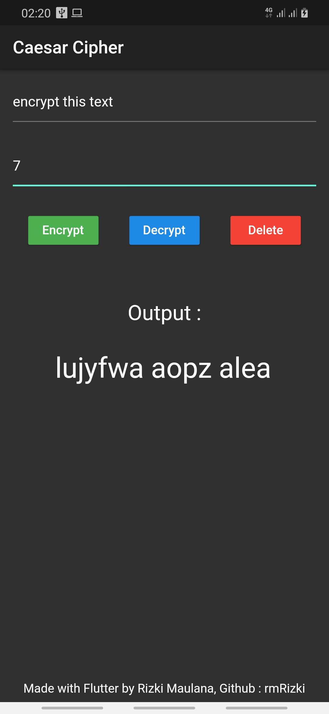

# Caesar Cipher App

This app demonstrate text encryption and decryption using [caesar cipher](https://en.wikipedia.org/wiki/Caesar_cipher).  

Check this link to see the web version of this project : <https://rmrizki.github.io/caesar_cipher_web/>

**Technology used :**

- Dart Language
- Flutter SDK

## Screenshot

  

## Getting Started

This project is a starting point for a Flutter application.

A few resources to get you started if this is your first Flutter project:

- [Lab: Write your first Flutter app](https://flutter.dev/docs/get-started/codelab)  
- [Cookbook: Useful Flutter samples](https://flutter.dev/docs/cookbook)

For help getting started with Flutter, view
[flutter online documentation](https://flutter.dev/docs), which offers tutorials,
samples, guidance on mobile development, and a full API reference.
